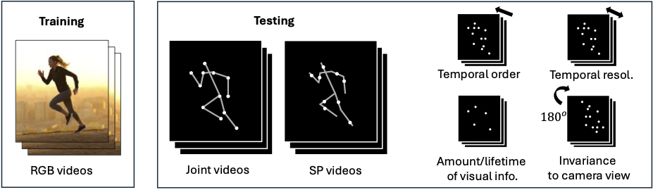
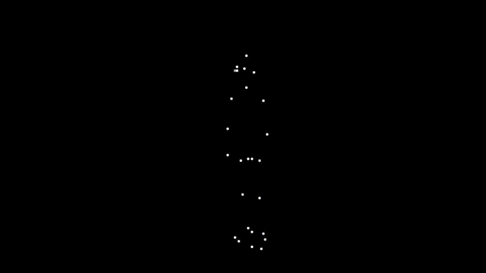
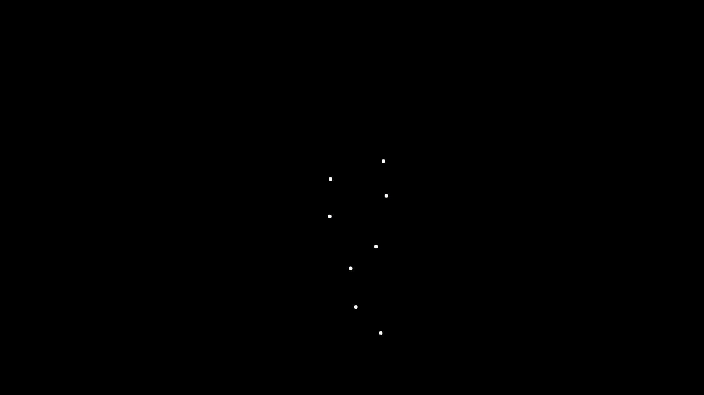

# Flow Snapshot Neurons in Action: Deep Neural Networks Generalize to Biological Motion Perception 

Authors: Shuangpeng Han, Ziyu Wang, Mengmi Zhang

This is a PyTorch implementation of the Motion Perceiver (MP) proposed by our paper. **Our paper has been accepted in NeurIPS 2024.**

<p align="left">
  <a href="http://arxiv.org/abs/2405.16493" target="_blank"></a>
</p>
<!--   &nbsp
  <a href="" target="_blank"></a>
  &nbsp
  <a href="" target="_blank"></a>
</p> -->

## Project Description

Biological motion perception (BMP) refers to humans' ability to perceive and recognize the actions of living beings solely from their motion patterns, sometimes as minimal as those depicted on point-light displays. While humans excel at these tasks without any prior training, current AI models struggle with poor generalization performance. To close this research gap, we propose the Motion Perceiver (MP). MP solely relies on patch-level optical flows from video clips as inputs. During training, it learns prototypical flow snapshots through a competitive binding mechanism and integrates invariant motion representations to predict action labels for the given video. During inference, we evaluate the generalization ability of all AI models and humans on 62,656 video stimuli spanning 24 BMP conditions using point-light displays in neuroscience. Remarkably, MP outperforms all existing AI models with a maximum improvement of 29\% in top-1 action recognition accuracy on these conditions. Moreover, we benchmark all AI models in point-light displays of two standard video datasets in computer vision. MP also demonstrates superior performance in these cases. More interestingly, via psychophysics experiments, we found that MP recognizes biological movements in a way that aligns with human behavioural data.

<br>
<p align="center">
</p>

Some sample video stimuli are shown below.

| [](Images/J-26P.gif)  | [](Images/J-6P.gif) |[](Images/SP-8P-1LT.gif)  |
|:---:|:---:|:---:|
| J-26P | J-6P | SP-8P-1LT | 

## Environment Setup

Our code is based on Pytorch 2.0.0, CUDA 11.2 and Python 3.9.

We recommend using [conda](https://conda.io/projects/conda/en/latest/user-guide/getting-started.html) for installation:

```
conda env create -f environment.yml

conda activate MP

cd MotionPerceiver

git clone https://github.com/facebookresearch/pytorchvideo.git

cd pytorchvideo

pip install -e .

cd ..

export PYTHONPATH=.

```

## Dataset
The RGB videos in our Biological Motion Perception (BMP) dataset are from NTU RGB+D 120 dataset, please download the dataset from the following link:

* [RGB+D 120](https://rose1.ntu.edu.sg/dataset/actionRecognition/)

To generate other BMP conditions, you may follow the instructions in [DATASET.md](DATASET.md) to prepare them.

Other datasets used to train and evaluate our model are as follows:
* [RGB+D 60](https://rose1.ntu.edu.sg/dataset/actionRecognition/)
* [NW-UCLA](https://wangjiangb.github.io/my_data.html)

## Training & Testing

Our codebase is structured in a manner similar to the [SlowFast](https://github.com/facebookresearch/SlowFast/tree/main) repository.

We use [Fast Forward Computer Vision (FFCV)](https://github.com/libffcv/ffcv/tree/main) to expedite data loading during training and testing. 

All hyperparameters are listed and explained in the [Config](Config/defaults.py).

Remember to modify the following parameters in the [YAML](YAML/BMP.yaml) file to your own:
* TRAIN.FFCV.DATAPATH_PREFIX
* TRAIN.SPLIT
* VAL.FFCV.DATAPATH_PREFIX
* VAL.SPLIT
* TEST.FFCV.DATAPATH_PREFIX
* TEST.SPLIT
* OUTPUT_DIR

For example,  if your training data is stored in ".../FFCV_data/train_RGB.beton", then TRAIN.FFCV.DATAPATH_PREFIX and TRAIN.SPLIT are ".../FFCV_data" and "train_RGB" respectively.

You can start training the model from scratch by running:

```
python3 Mainframe/run.py --cfg YAML/BMP.yaml
```

We use TRAIN.ENABLE and TEST.ENABLE in the [YAML](YAML/BMP.yaml) file to determine if training or testing should be performed for the current task. If you wish to conduct only testing, set TRAIN.ENABLE to False. 

You can test the model by running:

```
python3 Mainframe/run.py --cfg YAML/BMP.yaml\
  TEST.CHECKPOINT_FILE_PATH path_to_your_checkpoint \
  TRAIN.ENABLE False \
```

if you want to train or test our *Enhanced - Motion Perceiver (En-MP)* model, please remember to set MODEL.MODEL_NAME to En_MP in the [YAML](YAML/BMP.yaml) file.

Our pretrained MP model on RGB videos of BMP dataset is available at [link](https://drive.google.com/file/d/1bxRu81lND-IkicwaNkVMDfVHNj-qFnxV/view?usp=sharing). Our pretrained En-MP model on RGB videos of BMP dataset is available at [link](https://drive.google.com/file/d/1Ty-ytZsFUKGTb1pNME0jb_aI-X6ZuB0o/view?usp=sharing).
You can download the checkpoint and configure its path to TEST.CHECKPOINT_FILE_PATH for inference.

## Human Psychophysics Experiments on Amazon Mechanical Turk 

We have conducted a series of Mechanical Turk experiments using the [Psiturk](https://psiturk.org/) platform, which requires JavaScript, HTML, and Python 2.7. Please refer to [Put-In-Context](https://github.com/kreimanlab/Put-In-Context) and [doc](https://drive.google.com/open?id=1FblDG7OuWXVRfWo0Djb5eDiYgKqnk9wU) for detailed Psiturk instructions.

## Citation

If you find our work useful in your research, please use the following BibTeX entry for citation.

```
@article{han2024flow,
  title={Flow Snapshot Neurons in Action: Deep Neural Networks Generalize to Biological Motion Perception},
  author={Han, Shuangpeng and Wang, Ziyu and Zhang, Mengmi},
  journal={arXiv preprint arXiv:2405.16493},
  year={2024}
}
```
